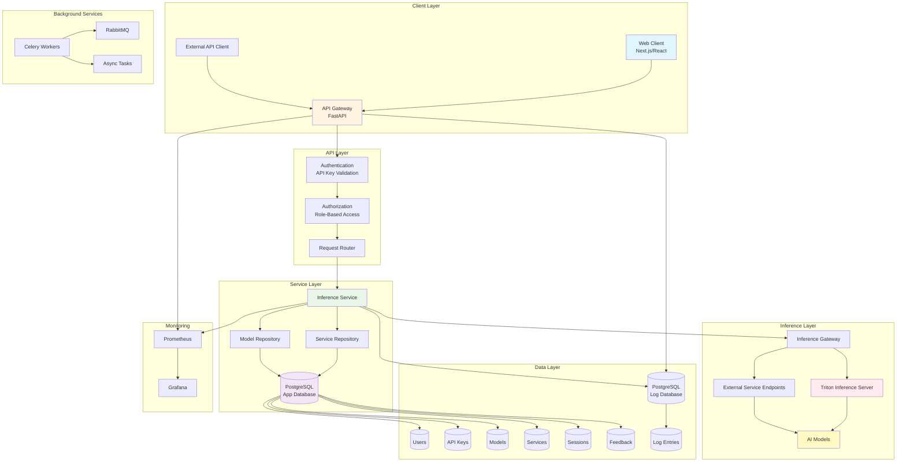
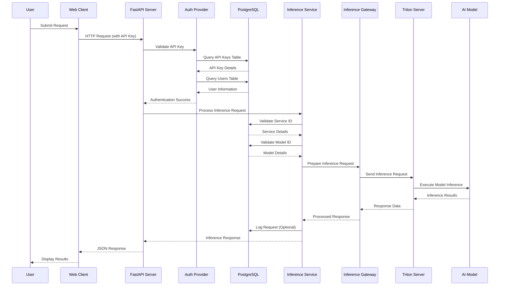

# Dhruva Platform - DPG Certification Repository

<div align="center">
  <h3 align="center">Dhruva</h3>
  <p align="center">
    A full-fledged platform for serving AI models at scale
  </p>
</div>

---

## 📋 About This Repository

This repository contains the Dhruva Platform codebase and documentation prepared for **Digital Public Goods (DPG) Alliance** certification. Dhruva is an infrastructure platform that enables authenticated users to access AI services, providing backend services and inference infrastructure for AI models.

### What is Dhruva?

Dhruva is a comprehensive platform designed to serve AI models at scale. It provides:

- **Backend Services**: Robust API infrastructure for AI model deployment
- **Inference Infrastructure**: High-performance inference pipelines for AI models
- **Authentication & Authorization**: Secure access control with API keys and role-based permissions
- **Model Management**: Complete lifecycle management for AI models and services
- **Monitoring & Analytics**: Built-in monitoring, logging, and analytics capabilities
- **Scalable Architecture**: Microservices-based architecture with Docker containerization

---

## 🏗️ Architecture

### Technology Stack

- **Frontend**: Next.js, React, TypeScript, Chakra UI
- **Backend**: FastAPI (Python)
- **Database**: PostgreSQL (migrated from MongoDB)
- **Task Queue**: Celery with RabbitMQ
- **Monitoring**: Prometheus, Grafana
- **Containerization**: Docker, Docker Compose

### System Architecture Flow



### Request Flow Diagram



### Database Architecture

The platform uses PostgreSQL with the following structure:

```
dhruva-platform-app-db-pg
├── users (UUID primary keys)
├── api_keys (Foreign keys to users)
├── models (JSONB for complex data)
├── services (Foreign keys to models)
├── sessions (Foreign keys to users)
└── feedback (JSONB for ULCA structures)

dhruva-platform-log-db-pg
└── log_entries (Application logging)
```

---

## 📚 Documentation

### Core Documentation

- **[Deployment Guide](docs/DEPLOYMENT_GUIDE.md)** - Complete step-by-step deployment instructions
- **[API Testing Guide](docs/API_TESTING_GUIDE.md)** - Comprehensive API endpoint testing documentation
- **[Troubleshooting Guide](docs/TROUBLESHOOTING_GUIDE.md)** - Common issues and solutions
- **[Migration Completion Report](docs/MIGRATION_COMPLETION_REPORT.md)** - MongoDB to PostgreSQL migration details

### Policies & Guidelines

- **[Do No Harm Policy](DO_NO_HARM.md)** - Platform's approach to minimizing misuse and unintended harm
- **[Privacy Policy](PRIVACY_POLICY.md)** - Data processing and privacy practices
- **[Best Practices](docs/BEST_PRACTICES.md)** - Development and architectural best practices

### Additional Resources

- **[OpenAPI Specification](docs/OPENAPI.json)** - Complete API documentation
- **[Data Type Mapping](docs/DATA_TYPE_MAPPING.md)** - Database schema and type mappings
- **[Conversation Context Summary](docs/CONVERSATION_CONTEXT_SUMMARY.md)** - Project context and migration summary

---

## 🚀 Quick Start

### Prerequisites

- **Docker**: Version 20.10+
- **Docker Compose**: Version 2.0+
- **Operating System**: Windows with WSL2, Linux, or macOS
- **Memory**: Minimum 8GB RAM (16GB recommended)
- **Storage**: Minimum 20GB free space

### Installation

1. **Clone the repository**
   ```bash
   git clone <repository-url>
   cd dpg_certification
   ```

2. **Navigate to the platform directory**
   ```bash
   cd Dhruva-Platform-2
   ```

3. **Set up environment variables**
   - Create a `.env` file from `.env.example`
   - Configure PostgreSQL connection strings and other required variables

4. **Deploy the platform**
   ```bash
   # Start database services
   docker compose -f docker-compose-db-postgresql.yml up -d
   
   # Start metering services
   docker compose -f docker-compose-metering.yml up -d
   
   # Start monitoring services
   docker compose -f docker-compose-monitoring.yml up -d
   
   # Start application services
   docker compose -f docker-compose-app.yml up -d
   ```

For detailed deployment instructions, see the [Deployment Guide](docs/DEPLOYMENT_GUIDE.md).

---

## 🔑 Key Features

### Platform Capabilities

- ✅ **User Management**: Authentication, authorization, and session management
- ✅ **API Key Management**: Secure API key generation and management
- ✅ **Model Deployment**: Deploy and manage AI models at scale
- ✅ **Service Management**: Create and manage AI services
- ✅ **Inference Pipelines**: High-performance inference processing
- ✅ **Monitoring & Logging**: Comprehensive monitoring and logging infrastructure
- ✅ **Analytics**: Usage analytics and performance metrics
- ✅ **Feedback System**: User feedback collection and management

### Database Features

- ✅ **ACID Compliance**: Full transactional integrity
- ✅ **UUID Primary Keys**: Consistent across all tables
- ✅ **JSONB Support**: Flexible document storage where needed
- ✅ **Foreign Key Constraints**: Enforced data relationships
- ✅ **Automatic Timestamps**: Created/updated tracking

---

## 📖 Platform Role

Dhruva operates as an **infrastructure platform** that:

- Provides backend services and inference infrastructure
- Enables authenticated users to access AI services
- Does **not** create, curate, publish, or moderate end-user content
- Does **not** determine how outputs are used
- Does **not** apply application-level content moderation

Applications built on top of Dhruva are operated by downstream integrators, who are responsible for end-user interactions, content moderation, and compliance with applicable laws.

For more details, see the [Do No Harm Policy](DO_NO_HARM.md) and [Privacy Policy](PRIVACY_POLICY.md).

---

## 🧪 Testing

To perform testing of the models hosted on Dhruva, please refer to the [Dhruva-Evaluation-Suite](https://github.com/AI4Bharat/Dhruva-Evaluation-Suite) repository.

- **Functional Testing**: Benchmark models against datasets with metrics like WER (for ASR), BLEU (for NMT), and others
- **Performance Testing**: Measure inference speeds and Requests/sec rate for all endpoints

For API testing, see the [API Testing Guide](docs/API_TESTING_GUIDE.md).

---

## 🤝 Contributing

1. Clone the Project
2. Create your Feature Branch (`git checkout -b feature/AmazingFeature`)
3. Commit your Changes (`git commit -m 'Add some AmazingFeature'`)
4. Push to the Branch (`git push origin feature/AmazingFeature`)
5. Open a Pull Request

---

## 📄 License

This project is licensed under the MIT License - see the [LICENSE](LICENSE) file for details.

**Copyright (c) 2025 COSS India**

---

## 🔗 Related Resources

- [Digital Public Goods Alliance](https://digitalpublicgoods.net/)
- [Principles For Digital Development](https://digitalprinciples.org/)
- [The Twelve Factor App](https://12factor.net/)

---

## 📞 Support

For questions, issues, or contributions, please refer to the documentation in the `docs/` directory or open an issue in the repository.

---

## 🎯 DPG Certification

This repository has been prepared for Digital Public Goods (DPG) Alliance certification. The repository includes:

- ✅ Open source codebase (MIT License)
- ✅ Comprehensive documentation
- ✅ Privacy policy
- ✅ Do No Harm policy
- ✅ Best practices documentation
- ✅ Deployment guides
- ✅ API documentation

---

<p align="right">(<a href="#dhruva-platform---dpg-certification-repository">back to top</a>)</p>


